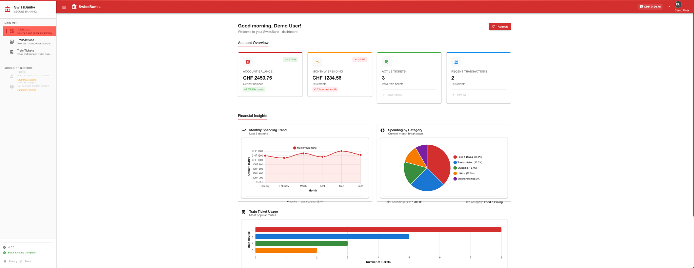

We have this SwissBank+ layout for dashboards.

# Dashboard Implementation Guide for Angular 20 Frontend Developer

**Project:** PythiaPlus (Angular 20)  
**Feature:** HR Dashboard - Phase 1 (MVP)  
**Status:** Backend APIs Ready ✅ | Frontend Implementation Needed 🔨

---

## 📋 Overview

You're building a new **Dashboard page** for HR to get instant insights into the talent pool. Think of it like the SwissBankPlus demo dashboards, but for employee availability, skills, and locations.



**Reference Design:**  
See the attached screenshot - you're building the same visual style with:
- Clean card-based layout
- Interactive charts (donut, horizontal bars)
- Smooth animations
- Click-to-filter functionality

---

## 🎯 Phase 1 Scope

Build **3 interactive widgets** using existing backend APIs:

1. **Availability Snapshot** - Donut/Pie Chart
2. **Top Skills** - Horizontal Bar Chart
3. **Top Locations** - Horizontal Bar Chart

All APIs are **already implemented** in the backend. No backend work needed.

---

## 🔌 Available APIs

### **1. Availability Facets API**

**Purpose:** Get count of employees by availability status

**Endpoint:**
```
GET /api/v1/search?query=&topK=100
```

**Response Structure:**
```json
{
  "facets": {
    "availability": [
      { "value": "available", "count": 6 },
      { "value": "notice", "count": 3 },
      { "value": "unavailable", "count": 1 }
    ]
  }
}
```

**Notes:**
- The search endpoint returns facets alongside search results
- Use empty query or wildcard to get all employees
- Facets are pre-aggregated counts from the database

---

### **2. Skills Facets API**

**Purpose:** Get count of employees per skill (top N skills)

**Endpoint:**
```
GET /api/v1/search?query=&topK=100
```

**Response Structure:**
```json
{
  "facets": {
    "skills": [
      { "value": "Node.js", "count": 7 },
      { "value": "PostgreSQL", "count": 7 },
      { "value": "Angular", "count": 7 },
      { "value": "React", "count": 5 },
      { "value": "Kubernetes", "count": 1 }
    ]
  }
}
```

**Notes:**
- Skills are sorted by count (descending)
- You may want to limit to top 10 for the dashboard
- Each count represents number of employees with that skill

---

### **3. City Facets API**

**Purpose:** Get count of employees per city

**Endpoint:**
```
GET /api/v1/search?query=&topK=100
```

**Response Structure:**
```json
{
  "facets": {
    "cities": [
      { "value": "Zurich", "count": 3 },
      { "value": "Prague", "count": 2 },
      { "value": "Valencia", "count": 1 },
      { "value": "Berlin", "count": 1 }
    ]
  }
}
```

**Notes:**
- Cities are sorted by count (descending)
- Null/empty cities are excluded
- You can also use `countries` facet for country-level view

---

### **4. Country Facets API**

**Purpose:** Get count of employees per country

**Endpoint:**
```
GET /api/v1/search?query=&topK=100
```

**Response Structure:**
```json
{
  "facets": {
    "countries": [
      { "value": "Switzerland", "count": 3 },
      { "value": "Czech Republic", "count": 2 },
      { "value": "Spain", "count": 2 }
    ]
  }
}
```

**Notes:**
- Same structure as cities
- Use for country-level geographic distribution

---

### **5. Technology Facets API**

**Purpose:** Get count of employees per technology (alternative to skills)

**Endpoint:**
```
GET /api/v1/search?query=&topK=100
```

**Response Structure:**
```json
{
  "facets": {
    "technologies": [
      { "value": "React", "count": 8 },
      { "value": "Node.js", "count": 7 },
      { "value": "PostgreSQL", "count": 6 }
    ]
  }
}
```

**Notes:**
- Technologies vs Skills: Technologies are tools/frameworks, Skills are competencies
- You can offer a toggle to switch between Skills/Technologies view

---

## 🎨 Dashboard Layout

### **Recommended Structure:**

```
┌─────────────────────────────────────────────────────┐
│  Dashboard Header                                   │
│  "Talent Pool Overview"                             │
└─────────────────────────────────────────────────────┘

┌──────────────────────┬──────────────────────────────┐
│                      │                              │
│  Availability        │  Top Locations               │
│  Snapshot            │  (City/Country Toggle)       │
│                      │                              │
│  [Donut Chart]       │  [Horizontal Bar Chart]      │
│                      │                              │
│  • Available: 6      │  Zurich        ████████ 3    │
│  • Notice: 3         │  Prague        █████    2    │
│  • Unavailable: 1    │  Valencia      ███      1    │
│                      │                              │
└──────────────────────┴──────────────────────────────┘

┌──────────────────────────────────────────────────────┐
│                                                      │
│  Top Skills / Technologies                           │
│  (Skills/Technologies Toggle)                        │
│                                                      │
│  [Horizontal Bar Chart - Full Width]                │
│                                                      │
│  Node.js           ██████████████████████ 7          │
│  PostgreSQL        ██████████████████████ 7          │
│  Angular           ██████████████████████ 7          │
│  React             ████████████████       5          │
│  TypeScript        ████████████           4          │
│  Kubernetes        ███                    1          │
│                                                      │
└──────────────────────────────────────────────────────┘
```

---

## 🎯 Widget Specifications

### **Widget 1: Availability Snapshot**

**Chart Type:** Donut or Pie Chart

**Data Source:** `facets.availability` from search API

**Visual Requirements:**
- 3 slices: Available (green), Notice (yellow/orange), Unavailable (red)
- Show count in legend: "Available (6)", "Notice (3)", "Unavailable (1)"
- Center text: Total count (e.g., "10 Total")
- Hover: Show percentage

**Interactivity (Optional for Phase 1):**
- Click on slice → navigate to employee search with availability filter pre-applied
- Example: Click "Available" → `/search?availability=available`

**Color Palette:**
- Available: `#10b981` (green)
- Notice: `#f59e0b` (amber)
- Unavailable: `#ef4444` (red)

---

### **Widget 2: Top Locations**

**Chart Type:** Horizontal Bar Chart

**Data Source:** `facets.cities` OR `facets.countries` (toggle)

**Visual Requirements:**
- Show top 5-10 locations
- X-axis: Count (0 to max)
- Y-axis: Location names
- Bars: Blue gradient or solid color
- Show count at end of each bar

**Interactivity:**
- Toggle button: "Cities" / "Countries" (switches data source)
- Click on bar → navigate to employee search with location filter
- Example: Click "Zurich" → `/search?city=Zurich`

**Color Palette:**
- Bars: `#3b82f6` (blue) or gradient `#3b82f6` → `#60a5fa`

---

### **Widget 3: Top Skills**

**Chart Type:** Horizontal Bar Chart (Full Width)

**Data Source:** `facets.skills` OR `facets.technologies` (toggle)

**Visual Requirements:**
- Show top 10 skills/technologies
- X-axis: Count (0 to max)
- Y-axis: Skill names
- Bars: Purple/indigo gradient
- Show count at end of each bar
- Longer chart (full width) to accommodate more items

**Interactivity:**
- Toggle button: "Skills" / "Technologies" (switches data source)
- Click on bar → navigate to employee search with skill filter
- Example: Click "Node.js" → `/search?skills=Node.js`

**Color Palette:**
- Bars: `#8b5cf6` (purple) or gradient `#8b5cf6` → `#a78bfa`

---

## 🔄 Data Flow

### **Recommended Approach:**

1. **Create a Dashboard Service** (`dashboard.service.ts`)
    - Fetch data from `/api/v1/search?query=&topK=100`
    - Extract facets from response
    - Transform data for chart components
    - Cache results (optional, 5-minute TTL)

2. **Create Dashboard Component** (`dashboard.component.ts`)
    - Call dashboard service on init
    - Pass data to child chart components
    - Handle loading/error states

3. **Create Chart Components** (reusable)
    - `availability-donut.component.ts`
    - `horizontal-bar-chart.component.ts` (reusable for locations & skills)
    - Accept data as `@Input()`
    - Emit click events as `@Output()`

4. **Handle Navigation**
    - On chart click, navigate to `/search` with query params
    - Use Angular Router with `queryParams`

---

## 📊 Chart Library Recommendations

**Option 1: Chart.js** (Recommended)
- Lightweight, well-documented
- Good Angular integration via `ng2-charts`
- Supports donut, bar, line charts
- Easy customization

**Option 2: Apache ECharts**
- More powerful, feature-rich
- Better for complex interactions
- Larger bundle size
- `ngx-echarts` wrapper available

**Option 3: D3.js**
- Maximum flexibility
- Steeper learning curve
- Full control over visuals
- No wrapper needed (use directly)

**Your choice** - all three work well with Angular 20.

---

## 🎨 Styling Guidelines

**Match the SwissBankPlus aesthetic:**

- **Cards:** White background, subtle shadow, rounded corners
- **Spacing:** Generous padding (24px), clean margins
- **Typography:**
    - Widget titles: 18px, semi-bold
    - Chart labels: 14px, regular
    - Counts: 16px, medium weight
- **Colors:** Use Tailwind CSS palette (if available) or define custom theme
- **Animations:**
    - Fade-in on load (300ms)
    - Smooth transitions on data updates
    - Hover effects on interactive elements

---

## 🚀 Implementation Steps

### **Step 1: Setup**
- Create new route: `/dashboard`
- Add navigation link in sidebar/header
- Create dashboard module (if using lazy loading)

### **Step 2: Service Layer**
- Create `DashboardService`
- Implement `getFacets()` method
- Add error handling and loading states

### **Step 3: Components**
- Create `DashboardComponent` (container)
- Create `AvailabilityDonutComponent`
- Create `HorizontalBarChartComponent` (reusable)

### **Step 4: Integration**
- Wire up service to components
- Implement chart rendering
- Add toggle switches (City/Country, Skills/Technologies)

### **Step 5: Interactivity**
- Add click handlers to charts
- Implement navigation to search page with filters
- Test all interactions

### **Step 6: Polish**
- Add loading spinners
- Add empty state handling ("No data available")
- Add responsive design (mobile/tablet)
- Add animations

---

## 🧪 Testing Checklist

- [ ] Dashboard loads without errors
- [ ] All 3 widgets display data correctly
- [ ] Donut chart shows correct counts and percentages
- [ ] Bar charts show top N items sorted by count
- [ ] Toggle switches work (City/Country, Skills/Technologies)
- [ ] Click on chart navigates to search with correct filter
- [ ] Loading states display during API calls
- [ ] Error states display if API fails
- [ ] Responsive design works on mobile/tablet
- [ ] Animations are smooth and professional

---

## 📝 API Notes

**Important:**
- The search API returns facets **alongside** search results
- You don't need to make separate API calls for each facet type
- One API call gives you: availability, cities, countries, skills, technologies, certifications
- Extract what you need from the single response

**Example Response Structure:**
```json
{
  "results": [...],  // Search results (ignore for dashboard)
  "totalCount": 10,
  "facets": {
    "availability": [...],
    "cities": [...],
    "countries": [...],
    "skills": [...],
    "technologies": [...],
    "certifications": [...]
  }
}
```

**Pro Tip:**  
Cache the facets response for 5 minutes to avoid unnecessary API calls when users toggle between views.

---

## 🎯 Success Criteria

**Your dashboard is ready when:**

1. ✅ HR can see availability distribution at a glance
2. ✅ HR can identify top skills in the talent pool
3. ✅ HR can see geographic distribution of employees
4. ✅ HR can click on any chart to drill down to employee list
5. ✅ Dashboard loads in < 2 seconds
6. ✅ Visual design matches SwissBankPlus quality
7. ✅ Works on desktop, tablet, and mobile

---

## 🚀 Future Enhancements (Not in Phase 1)

**Phase 2 ideas** (don't implement now, but keep in mind):
- Summary cards at the top (Total Profiles, Available Now, Avg Experience)
- Growth trend line chart (requires new API)
- Experience distribution histogram (requires new API)
- Department/Seniority breakdown (requires new API)
- Export to PDF/Excel
- Date range filters
- Real-time updates (WebSocket)

---

## 📞 Questions?

If you need clarification on:
- **API structure** → Check the existing search page implementation
- **Design specs** → Refer to SwissBankPlus screenshot
- **Routing/Navigation** → Use existing search page as reference
- **Chart interactions** → Click should navigate to search with filters

**You have everything you need to build this!** 🚀

Good luck, and make it look amazing! 🎨✨


